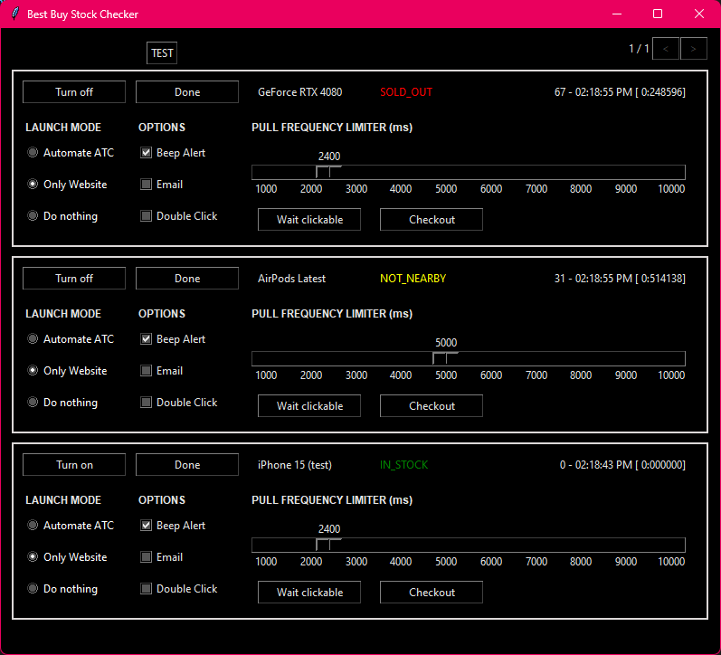

# StockCheckerUI

**StockCheckerUI** is a Python Tkinter-based application that allows users to quickly and efficiently check item stock levels. With its user-friendly interface, StockCheckerUI simplifies stock management tasks for small businesses or personal inventory tracking.

## Features

- **Stock Checking**: Easily query item stock levels.
- **Interactive GUI**: Simple and intuitive Tkinter interface for ease of use.
- **Lightweight and Fast**: Designed for quick deployment and minimal system resource usage.

## Installation

Follow these steps to get started with **StockCheckerUI**:

1. Clone the repository:
   ```bash
   git clone https://github.com/fsoto-GH/StockCheckerUI.git
   ```
2. Navigate to the project directory:
   ```bash
   cd StockCheckerUI
   ```
3. Install the required dependencies:
   ```bash
   pip install -r requirements.txt
   ```
4. Run the application:
   ```bash
   python main.py
   ```

## Requirements

- Python 3.7 or higher
- Tkinter (included in Python's standard library)

## Screenshots



## Future Enhancements

- Add database integration for persistent stock tracking.
- Implement search and filter features.
- Export stock data to CSV or Excel.

## License

This project is licensed under the [MIT License](LICENSE).
